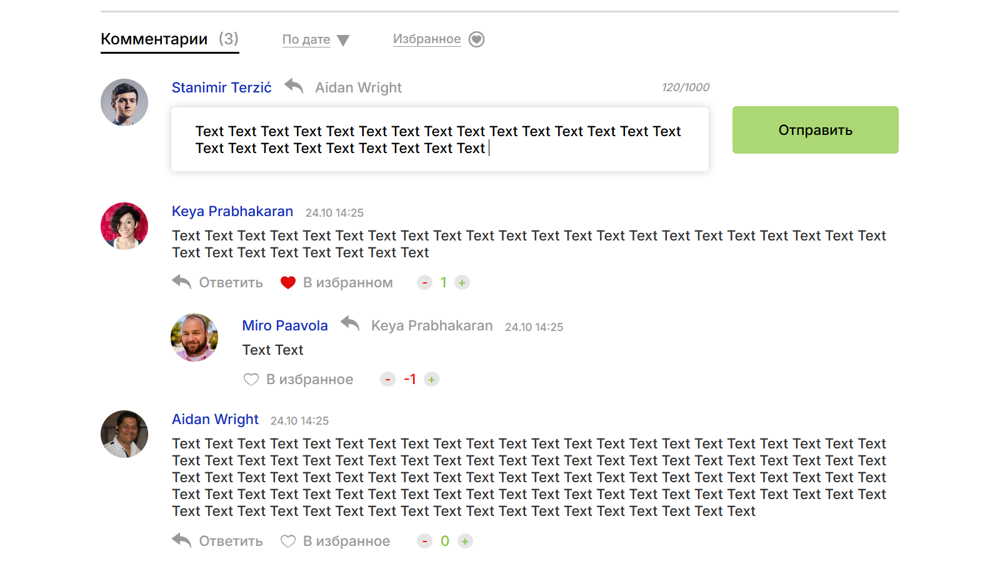

# Comment_system_TS

 

### With:
:heavy_check_mark: HTML  
:heavy_check_mark: CSS  
:heavy_check_mark: TS  
:heavy_check_mark: Responsive-Design 

### Without:
:x: Preprocessors 
:x: Libraries 
:x: Frameworks 
:x: Pixel-Perfect 

#### Original layout: *[Figma](https://www.figma.com/design/aKcOut6PbRTAfBmwQjUNJP/%D0%BC%D0%B0%D0%BA%D0%B5%D1%82-%D0%B1%D0%BB%D0%BE%D0%BA%D0%B0-%D1%81-%D0%BA%D0%BE%D0%BC%D0%BC%D0%B5%D0%BD%D1%82%D0%B0%D0%BC%D0%B8-(Copy)?node-id=0-1&t=6zcXhrYICi2ImDIs-1)*
